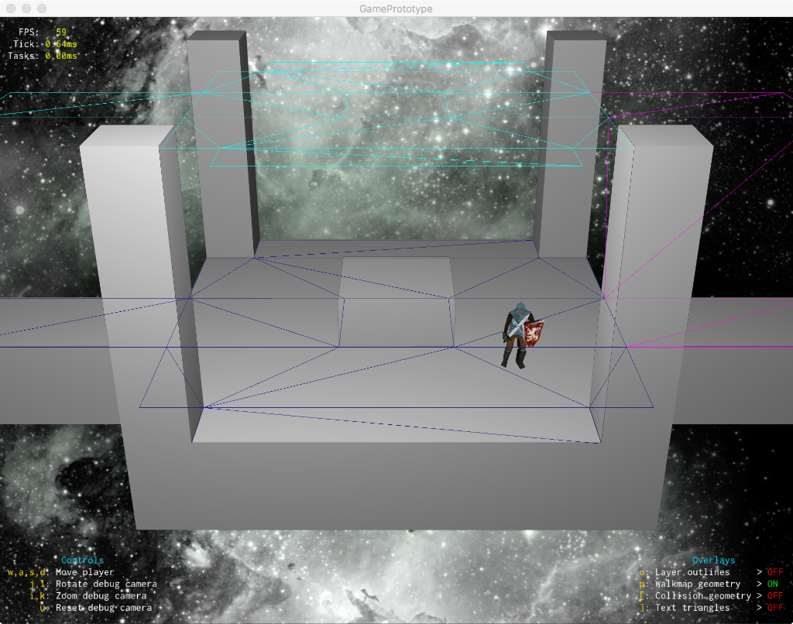

# SceneFlipEngine

SceneFlipEngine is a toy/prototype for a mixed 2D/3D adventure game (engine) composed of many linked scenes with arbitrary transitions (slide, fade, zoom, etc) between them.

Scenes are constructed from pre-drawn 2D layers composed in a 3D space, with a walkmap defining where  the 3D actors can move.  The core idea was to build a game that had 3D characters moving realistically around a 3D world drawn using 2D artwork techniques (e.g. hand drawing).

This project was originally created in 2012 as an excuse to learn and play with several technologies and techniques:

* Building a cross platform engine with native platform frontends (starting with OSX and iOS)
* Dual compatibility for OpenGL and OpenGL ES
* Forced perspective rendering with OpenGL
* Using Lua as a scripting language for level definitions and interactions
* Performing scene loading and other heavy tasks on background threads
* Using Box2D for collisions

The project was cleaned up and originally open sourced in 2017.

Its current state is a rough prototype with a couple of test levels demonstrating the main features:

